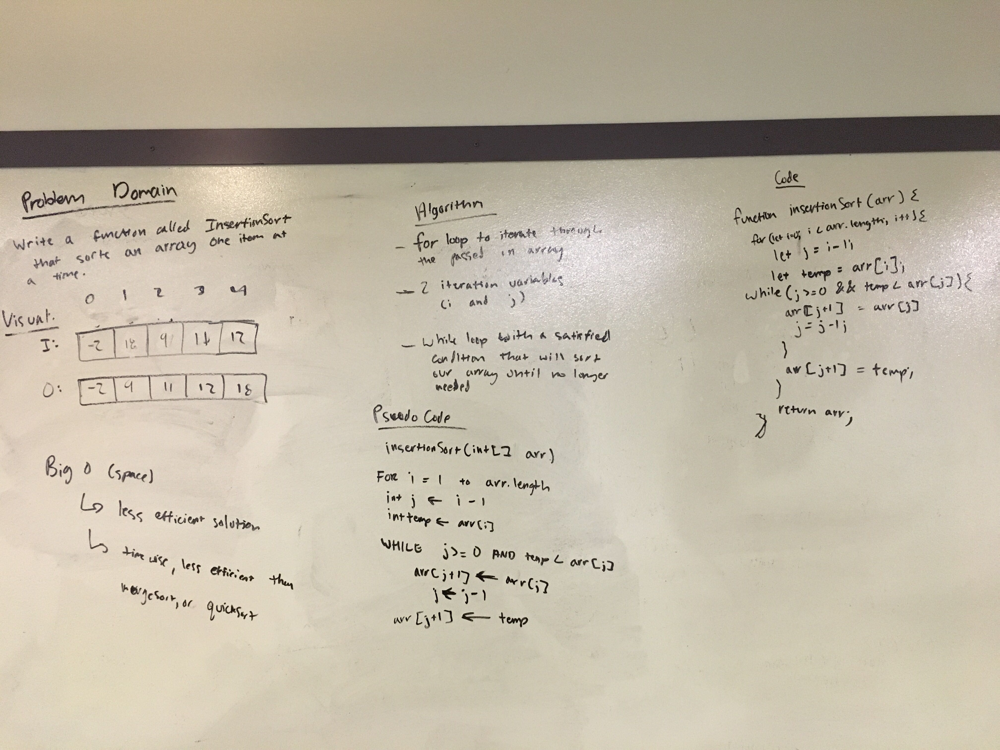

# Blog Notes - Insertion Sort
* Insertion Sort is a simple sorting algorithm that builds a sorted array one item at a time.  It is `much less efficient than the more advanced algorithms such as quicksort, heapsort, or merge sort`.

* Advantages of Insertion Sort are that:
    * `It has a simple implementation`
    * `Efficient for small data sets`
    * `More efficient in practice than other sorting algorithms like bubble sort`

#### Learning Objectives
* `How Insertion Sort works`

### Diagram

#### Algorithm 
* `Set a marker for the sorted section after first element`
* `Repeat:`
    * `Select first unsorted element`
    * `Swap other elements to the right to create position and shift unsorted element`
    * `Advance marker one element to the right`

#### PseudoCode
    InsertionSort(int[] arr)

    FOR i = 1 to arr.length
    
      int j <-- i - 1
      int temp <-- arr[i]
      
      WHILE j >= 0 AND temp < arr[j]
        arr[j + 1] <-- arr[j]
        j <-- j - 1  
        
      arr[j + 1] <-- temp

#### Readings and References
[Video](https://www.youtube.com/watch?v=OGzPmgsI-pQ)

[Reading](https://www.geeksforgeeks.org/insertion-sort/)

[Reading](https://en.wikipedia.org/wiki/Insertion_sort)

