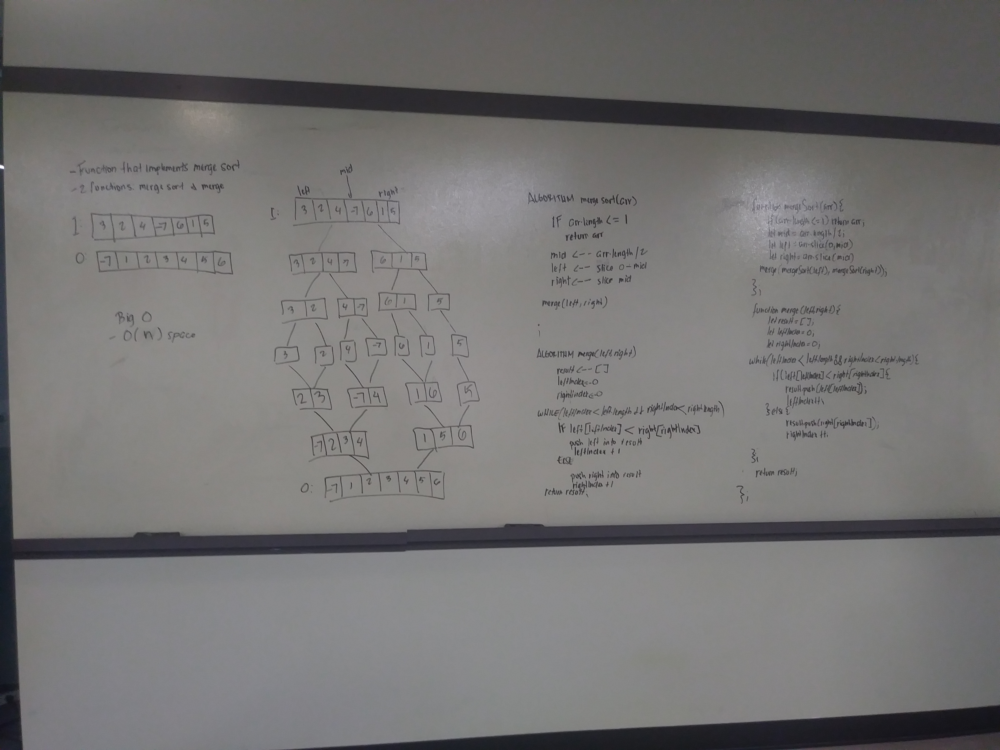

# Blog Notes - Merge Sort
* Merge Sort is a efficient, general-purpose, comparison-based sorting algorithm.  Uses the Divide and Conquer algorithm.  It `is one of the much more efficient algorithms such as quicksort and heapsort`.

#### Learning Objectives
* `How Merge Sort works`

### Diagram

#### Algorithm 
* `Divide the unsorted list into n sublists, where each sublist has only one element`
* `Repeatedly merge all the sublists into sorted sublists until you have one final sorted sublist left over`

#### PseudoCode
    ALGORITHM Mergesort(arr)
    DECLARE n <-- arr.length
           
    if n > 1
      DECLARE mid <-- n/2
      DECLARE left <-- arr[0...mid]
      DECLARE right <-- arr[mid...n]
      // sort the left side
      Mergesort(left)
      // sort the right side
      Mergesort(right)
      // merge the sorted left and right sides together
      Merge(left, right, arr)

    ALGORITHM Merge(left, right, arr)
    DECLARE i <-- 0
    DECLARE j <-- 0
    DECLARE k <-- 0

    while i < left.length && j < right.length
        if left[i] <= right[j]
            arr[k] <-- left[i]
            i <-- i + 1
        else
            arr[k] <-- right[j]
            j <-- j + 1
            
        k <-- k + 1

    if i = left.length
       set remaining entries in arr to remaining values in right
    else
       set remaining entries in arr to remaining values in left

#### Readings and References
[Video](https://www.youtube.com/watch?v=JSceec-wEyw)

[Reading](https://www.geeksforgeeks.org/merge-sort/)

[Reading](https://en.wikipedia.org/wiki/Merge_sort)

