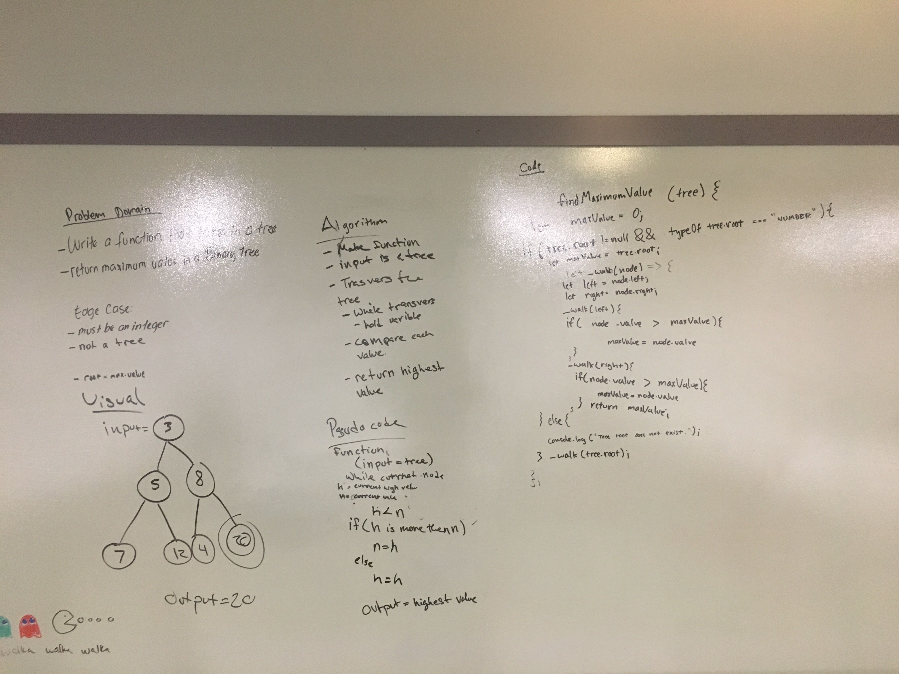

# Trees
<!-- Short summary or background information -->
#### Binary Tree
#### Breadth First Traversal

## Challenge
<!-- Description of the challenge -->
## Create a Node Class: 
Create a Node class that has properties for the value stored in the node, the left child node, and the right child node.

## Create a BinaryTree class:

Define a method for each of the depth first traversals called preOrder, inOrder, and postOrder which returns an array of the values, ordered appropriately.

## Create a BinarySearchTree class:

Define a method named add that accepts a value, and adds a new node with that value in the correct location in the binary search tree.

Define a method named contains that accepts a value, and returns a boolean indicating whether or not the value is in the tree at least once.

## Breadth First Traversal

Write a breadth first traversal method which takes a Binary Tree as its unique input. Without utilizing any of the built-in methods available to your language, traverse the input tree using a Breadth-first approach; print every visited node’s value.

## Approach & Efficiency
<!-- What approach did you take? Why? What is the Big O space/time for this approach? -->
### BreadthFirst Efficiency

Less efficient because of our usage of 2 arrays in our solution, however, our solution only requires one traversal of the tree.  The challenge was approached with the assumption that a balanced tree is given, and that assumption leads me to believe that any balanced tree with a longer height will lead to a longer runtime (linearly, or aka linear runtime).

## API
<!-- Description of each method publicly available in each of your trees -->
### preOrder
PreOrder traversal of a binary tree

### inOrder
inOrder traversal of a binary tree

### postOrder
PostOrder traversal of a binary tree

### breadthFirst
LevelOrder traversal of a binary tree

### insert method
Inserts values and creates trees

### findMaximumValue method
Finds and returns the maximum value stored within all nodes of a Binary Tree

## UML

